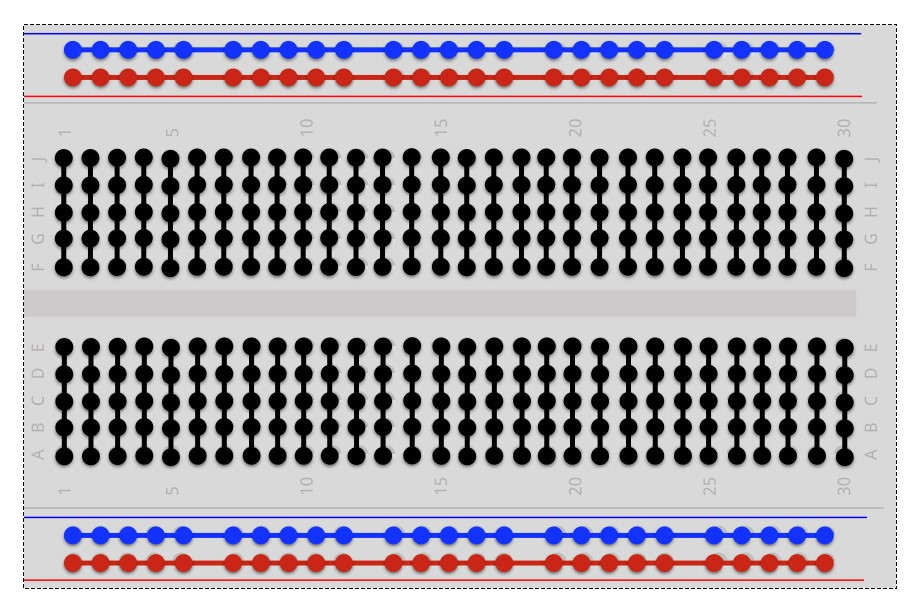
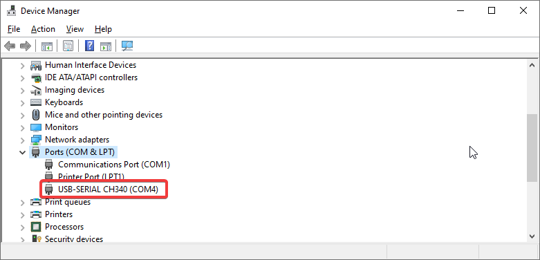
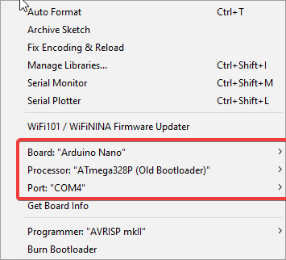
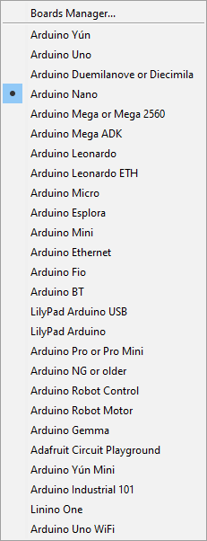
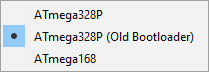
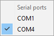
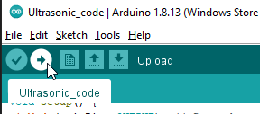
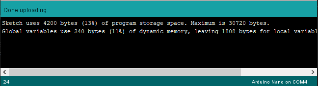

# The Basics 

## Bread Board

A standard bread board is layed out in two halves with a each half having 5 inner rows labeled a-b and j-k and 2 outer rows labelled as + and -. The outer rows are connected along the whole length of the baord while the inner rows are connected across the widht of the board. Each half of the board is electrically seperate from each other. It is best practice to place micro controllers and other chips straddling the center channel.

    

## Series & Parallel

To connect resistors or any other components in a parallel configuration both legs of the compenent must but in holes in the same row. However for connecting them in a series configuration only one leg of each component must share a row. This can be achieved in many ways, the diagram below shows a basic demonstration of this although it takes up quite some space.

    

## Resistors Values

Resistors are marked with different colours to show what their resistance is. They can come with or 4 - 5 "bands" of colour. The first 2 bands (3 in the case there are 5 bands) represent a decimal number each, the 3rd band is a multiplier and the last band reresents the resistors tolerance. The lower the tolerence of the resistor the more accurate it will be. See the image for a table of the resistor colour code values.

[Resistor Colour Code Calculator](https://www.digikey.co.uk/en/resources/conversion-calculators/conversion-calculator-resistor-color-code)

    

## Arduino

The [Arduino IDE](https://www.arduino.cc/en/software) can be used for writing, compiling and uploading your arduino code to your arduino board. When you're ready to upload your code to the board open the code inside the Arduino IDE and plug your Arduino into the your PC over USB. To idenify what port the arduino is on Windows open Device Manager and look for the `Ports (Com & LPT)` tab and expand it. In here look for your Arduino device. It maybe listed as a USB-SERIAL device.

    

Make a note of the port number beside the device, in this example it happens to be on `COM4`. Back in the Arduino IDE open the tools drop down menu. There are 3 settings here to be changed: `Board`, `Processor`, `Port`

    

First looking at the Board menu. Open this tab and select the board you are using from the menu. In this example the Arduino Nano was being used. Next opening the Processor tab from here select the appropriate processor for your board. **Note:** In most cases when using the Arduino Nano you will want to choose the `ATmega328P (Old Bootloader)`. Finally open the Port tab and the chose the port number matching to the one you noted earlier.

    
    
    

From here everything should all be set up. To compile click the arrow icon beside the check mark at the top of the Arduino IDE window. From here the code should compile and be uploaded. To view the progress of the process check the green bar and terminal window at the bottom of the screen. Any errors will show up here. If everything was compiled and uploaded correctly there will be a message saying `Done uploading`

    
    

[Return To Homepage](./index.md)
