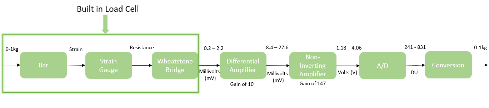

# Load Cell [](./index.md)

## Table of contents

1. [Introduction](#introduction)
   1. [How it works](#how-it-works)
2. [Circuit layout on breadboard](#circuit-layout-on-breadboard)
3. [Calculating the gain](#calculating-the-gain)
4. [Block Diagram](#block-diagram)
5. [Arduino Code](#arduino-code)
6. [Excel Spreadsheet ](#excel-spreadsheet)
   1. [Excel Graphs ](#excel-graphs)
7. [Setup for the demonstration](#setup-for-the-demonstration)
   1. [Equipment for the demonstration](#equipment-for-the-demonstration)
   2. [Installation of the circuit and code](#installation-of-the-circuit-and-code)
   3. [Testing](#testing)
8. [Load Cell demonstration](#load-cell-demonstration)

# Introduction

Load cell sensor is going to be used to measure the weight of the water in a tank. The load cell sensor that we are going to be using is the ARD2-2151 Load Cell. Click [here](https://www.wiltronics.com.au/wp-content/uploads/datasheets/ARD2-2151%20Data%20Sheet.pdf) to see the data sheet.

<p align="center">
    
</p>

## How it works

- Load cell is a transducer which measures force and delivers this force as an electrical signal. The load cell is a metal bar and when a load is applied on a bar this will cause the bar to bend. This force will then cause a change in resistance according to the weight of the load. The Wheatstone bridge which is located inside the load cell become unbalance with the change in resistance and causing an increase in differential voltage at the output junction of the bridge. This will then be amplified using the LM324 and code will be written in Arduino IDE to re-scale the signal to weights in ml.

## Circuit layout on breadboard

<p align="center">
    
</p>

## Calculating the gain

To calculate an appropriate gain of the system, for a resolution of 1g as in this system. The arduino has a resolution of 5mV so we want 1g = 5mV. To find our max value we need to find what 1000g should be equal to. For a resolution of 1g that's (1000\*.005)/1 which gives 5V. With no amplification the load cell outputs 2.2mV so it means amplifying it by approximately 1500 to reach just less than 5V. This can be achieved in many ways. In this example we will use a differential amplifier with a gain of 10 and a non-inverting amplifier with a gain of 147. The equation for the gain of a differential amplifier is Rf/Rin assuming Rf = Rg and Rin = R1 = R2.

<p align="center">
    
</p>

To get a gain of 10 we can use Rf = 1M and Rin = 100k resistors. This gives a high enough input impedance to the circuit to avoid any significant amount of loading. This is then passed into the non inverting amp which we use the equation (Rf + Rg)/Rg which to get a gain of 147k we can use 100k and 47k ohm resistor in series and a 1k ohm resistor to ground to give a gain of 147.

<p align="center">
    
</p>

## Block Diagram

<p align="center">
    
</p>

### Arduino Code

Download the code in the following:
[here](https://github.com/RebeccaFan/Agribot-Documentation/releases/download/1.0.0/LoadCell_code.zip)

```
int dataInPin = A0;
int dataIn;
float outputml;
```

These first three lines are just defining variables used through out the program.
dataInPin is set to A0, for this exact code to work you must connect the output of the op-amp to pin A0 on the arduino nano. This is where the voltage will be read in from.

```
void setup()
{
    Serial.begin(9600);
}
```

These few lines set up serial communications between the arduino and the pc so it can display the interpreted data on the serial monitor.

```
void loop()
{
    delay(500);
    dataIn = analogRead(dataInPin);
```

The start of the arduino loop code, begins with a 500ms delay before reading in the the voltage on the dataInPin which was previously defined at pin A0 on the arduino nano.

```
    outputml = map(dataIn, 241, 830, 0, 1000);
```

The map function is used to map the input range of the arduino to a 241 to 830 bits range for 0 to 1000ml. The input range is 241 to 814 because at 0ml the load cell reads 1.18V while at 1000ml the load cells reads 3.98V to convert this to a digital input multiplying it by the resolution of the Arduino of 204.6 bits which gave a range of 241 to 814 bits. For more information on the map function please see the [documentation](https://www.arduino.cc/reference/en/language/functions/math/map/)

```
    Serial.print("Voltage Input: ");
    Serial.print(dataIn);
    Serial.print("\t\t\t");

    Serial.print("Volume of water in tank: ");
    Serial.print(outputml);
    Serial.print(" ml\n");
}
```

These last lines are used to print out the recorded data to the serial monitor. It first prints out the amplified voltage from the load cell then then the volume in of water left in the tank.

## Excel Spreadsheet

| **Mass (g)** | **Voltage (mV)** | **Vout (mV), Gain 10** | **Vout (V), Gain 201** | **A/D (DU)** |
| :----------: | :--------------: | :--------------------: | :--------------------: | :----------: |
|      0       |       0.2        |          08.4          |          1.18          |   241.428    |
|     196      |       0.6        |          11.9          |          1.72          |   351.912    |
|     506      |       1.2        |          17.9          |          2.6           |    531.96    |
|     702      |       1.6        |          21.9          |          3.21          |   656.766    |
|    1,000     |       2.2        |          27.6          |          4.06          |   830.676    |

### Excel Graphs

<p align="center">
    
</p>

<p align="center">
    
</p>

<p align="center">
    
</p>

<p align="center">
    
</p>

## Setup for the demonstration

In this section, it will be listing in order the following steps that are needed to be taken in order to build circuit and do the demonstration.

### Equipment for the demonstration

To set up for the demonstration the required equipment is listed below:

- ARD2-2151 Load cell
- G-clamp
- Resistors
  - x2 1M ohms
  - x3 100k ohms
  - 47k ohms
  - 1k ohms
- Arduino Nano and cable
- Different colour wires
  - red for Vcc
  - black for ground
  - green for connecting the sensor to Arduino
- Breadboard
- LM324 Operational Amplifier
- Computer (download Arduino IDE)
- Different weights

### Installation of the circuit and code

1. The connections of the resistors for the differential amp are shown in the diagram below this will give us a gain of 10. Note that pin 4 is needed to be connected to the 9V and pin 11 needs to be connected to ground. The resistors that we used were two 1M ohms (brown, black, green) and two 100k ohms (brown, black, yellow).
<p align="center">
    
</p>

2. The output of the differential op-amp which is in pin 1 is then connected the (+ve) pin of the non-inverting amplifier. To get the gain of 200 we used the resistor values two 100k ohms. 9V battery is used as the voltage source. Refer to the diagram below to clearly see the connections.
<p align="center">
    
</p>

### Testing

1. Firstly, gather different things that have different weights, i.e. choose a wide range of weights. ( e.g. 196g, 506g, 702g and 1kg)
2. Verify and upload the code again to the Arduino Nano. Once done, look at the serial monitor in the Arduino IDE. This is where you are going to see the Voltage input values and volume of water in a tank in ml according to the weight that is being tested.
3. How we tested the load is that we took a plastic bag and inserted it in one of the holes of the load cell, we then place one of the weights (e.g. 1kg) into the bag and observe the serial monitor in the Arduino IDE.
4. Repeat step 3 but with different weights and see if the output weight that you get is the expected value i.e. almost the same when you measure it on a kitchen scale and using the multi-meter.

## Load Cell demonstration

Link to the demonstration of the Load Cell circuit.

[](https://www.youtube.com/watch?v=c-6xIRmTkGc)

## Trouble Shooting
When working in hardware issues and inconsistencies can occur that could not be predicted in theory. One such issue we ran into when demo-ing this circuit which we had not experienced the day before when recording the data, was that the amplifier wouldn't change for anything less than about 360ml this was most likely down to an issue with the amplifier itself. After verfiying the circuit has been built correctly, if you are still experiencing issues I would advise replacing individual hardware components, starting with the op-amp as this is more likely to fail than any of the resistors.
