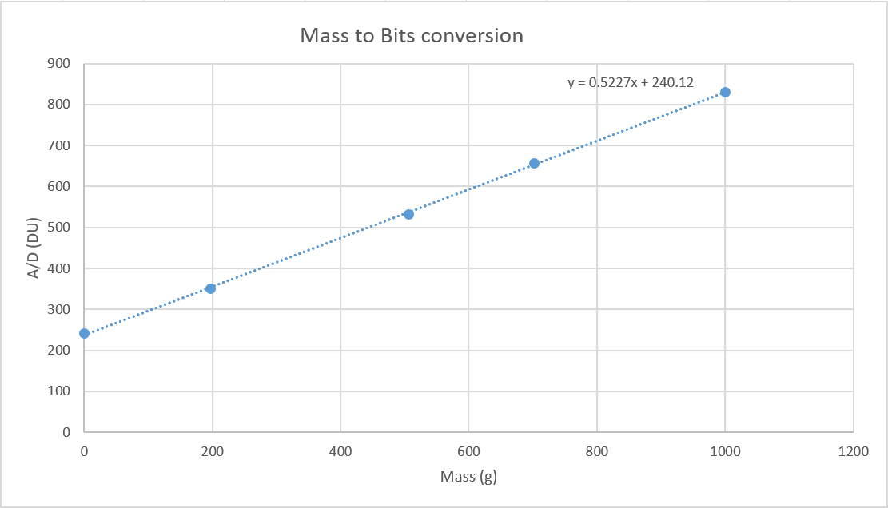

# Load Cell [](./index.md)

## Table of contents

1. [Introduction](#introduction)
   1. [How it works](#how-it-works)
   2. [When to use a load cell](#when-to-use-a-load-cell)
   3. [Strain-gauge load cell](#strain-gauge-load-cell)
2. [Circuit layout on breadboard](#circuit-layout-on-breadboard)
3. [Block Diagram](#block-diagram)
4. [Arduino Code](#arduino-code)
5. [Excel Spreadsheet ](#excel-spreadsheet)
   1. [Excel Graphs ](#excel-graphs)
6. [Setup for the demonstration](#setup-for-the-demonstration)
   1. [Equipment for the demonstration](#equipment-for-the-demonstration)
   2. [Initial installation of the circuit and code](#initial-installation-of-the-circuit-and-code)
   3. [Testing](#testing)
7. [Load Cell demonstration](#load-cell-demonstration)

# Introduction

Load cell sensor is going to be used to measure the weight of the water in a tank. The load cell sensor that we are going to be using is the ARD2-2151 Load Cell. Click [here](https://www.wiltronics.com.au/wp-content/uploads/datasheets/ARD2-2151%20Data%20Sheet.pdf) to see the data sheet.

<p align="center">
    
</p>

## How it works

- Load cell is a transducer which measures force and delivers this force as an electrical signal. The load cell is a metal bar and when a load is applied on a bar this will cause the bar to bend. This force will then cause a change in resistance according to the weight of the load. The Wheatstone bridge which is located inside the load cell become unbalance with the change in resistance and causing an increase in differential voltage at the output junction of the bridge. This will then be amplified using the LM324 and code will be written in Arduino IDE to re-scale the signal to weights in ml.

## Circuit layout on breadboard

<p align="center">
    
</p>

## Block Diagram

<p align="center">
    
</p>

### Arduino Code

Download the code in the following:
[here](https://github.com/RebeccaFan/Agribot-Documentation/releases/download/1.0.0/PT100_ReScaling_Code.zip)

```
int dataInPin = A0;
int dataIn;
float outputml;
```

These first three lines are just defining variables used through out the program
dataInPin is set to A0, for this exact code to work you must connect the output of the op-amp to pin A0 on the arduino nano. This is where the voltage will be read in from.

```
void setup()
{
    Serial.begin(9600);
}
```

These few lines set up serial communications between the arduino and the pc so it can display the interpreted data on the serial monitor.

```
void loop()
{
    delay(500);
    dataIn = analogRead(dataInPin);
```

The start of the arduino loop code, begins with a 500ms delay before reading in the the voltage on the dataInPin which was previously defined at pin A0 on the arduino nano.

```
    outputml = map(dataIn, 306, 814, 366, 1000);
```

The map function is used to map the input range of the arduino to a 366 to 1000 range for 0 to 1000ml. The input range is 306 to 814 because at 0ml the load cell reads 1.5V while at 1000ml the load cells reads 3.98V to convert this to a digital input multiplying it by the resolution of the Arduino of 204.6 bits which gave a range of 306 to 814 bits. For more information on the map function please see the [documentation](https://www.arduino.cc/reference/en/language/functions/math/map/)

```
    Serial.print("Voltage Input: ");
    Serial.print(dataIn);
    Serial.print("\t\t\t");

    Serial.print("Volume of water in tank: ");
    Serial.print(outputml);
    Serial.print(" ml\n");
}
```

These last lines are used to print out the recorded data to the serial monitor. It first prints out the amplified voltage from the load cell then then the volume in of water left in the tank.

## Excel Spreadsheet

| **Mass (g)** | **Voltage (mV)** | **Vout (mV), Gain 10** | **Vout (V), Gain 200** | **A/D (DU)** |
| :----------: | :--------------: | :--------------------: | :--------------------: | :----------: |
|      0       |       0.2        |          11.1          |         1.5 \*         |    306.9     |
|     196      |       0.6        |          11.2          |          1.5           |    306.9     |
|     506      |       1.2        |          14.7          |          2.13          |   435.798    |
|     702      |       1.6        |          18.4          |          2.9           |    593.34    |
|    1,000     |       2.2        |          24.1          |          3.98          |   814.308    |

\*Value stays at 1.5V from 0g to 366g

### Excel Graphs

<p align="center">
    
</p>

<p align="center">
    
</p>

<p align="center">
    
</p>

<p align="center">
    
</p>

## Setup for the demonstration

In this section, it will be listing in order the following steps that are needed to be taken in order to build circuit and do the demonstration.

### Equipment for the demonstration

To set up for the demonstration the required equipment is listed below:

- ARD2-2151 Load cell
- G-clamp
- Resistors
  - x2 1M ohms
  - x4 100k ohms
  - 1k ohms
- Arduino Nano and cable
- Different colour wires
  - red for Vcc
  - black for ground
  - green for connecting the sensor to Arduino
- Breadboard
- LM324 Operational Amplifier
- Computer (download Arduino IDE)
- Different weights

### Initial installation of the circuit and code

1. Collect all the equipment listed above.
2. For clarity of the circuit, make sure that you use different colours for the wirings. i.e., red for Vcc, black for ground and y or other colour (except the 2 colours that already mentioned) for the wiring of the ultrasonic sensor to the Arduino Nano digital pins.
3. Place your Arduino Nano onto the breadboard as well as the 4 wires of the load cell.

- Red wire goes to 5V and black wire goes to the ground
- Green wire is connected to 100k ohms and into pin 3 (-ve) of amplifier
- White wire is connected to another 100k ohms and into pin 2 (+ve) of amplifier
- Red wire of the load cell is connected to the 5V from the Arduino Nano

4. The connections of the resistors for the differential amp are shown in the diagram below this will give us a gain of 10. Note that pin 4 is needed to be connected to the 9V and pin 11 is needed to be connected to ground. The resistors that we used were two 1M ohms and two 100k ohms.
<p align="center">
    
</p>

5. The output of the differential op-amp which is in pin 1 is then connected the (+ve) pin of the non-inverting amplifier. To get the gain of 200 we used the resistor values two 100k ohms. 9V battery is used as the voltage source. Refer to the diagram below to clearly see the connections.
<p align="center">
    
</p>

6. Download Arduino IDE and copy the code provided in this page for the load cell sensor, if you are having problems with the settings in Arduino refer to the “start with basic” in the main page.
7. Once the code has been verified and uploaded the initial installations is now done and refer to the following steps below to test the sensor.

### Testing

1. Firstly, gather different things that have different weights, i.e., choose weights that are not closely similar. (196g, 506g, 702g and 1kg)
2. Verify and upload the code again to the Arduino Nano. Once done, look at the serial monitor in the Arduino IDE. This is where you are going to see the Voltage input values and volume of water in a tank in ml according to the weight that is being tested.
3. How we tested the load is that we took a plastic bag and inserted it in one of the holes of the load cell, we then place one of the weights (e.g., 1kg) into the bag and observe the serial monitor in the Arduino IDE.
4. Repeat step 3 but with different weights and see if the output weight that you get is the expected value i.e., almost the same when you measure it on a kitchen scale and using the multi meter.

## Load Cell demonstration

[](https://youtu.be/c-6xIRmTkGc)
