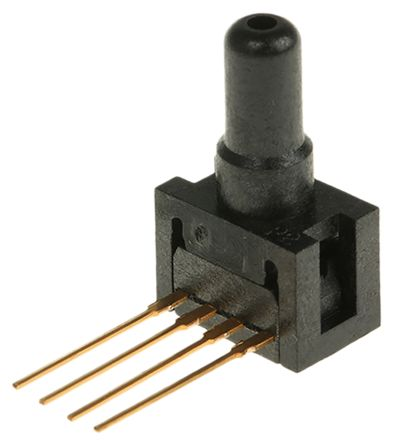
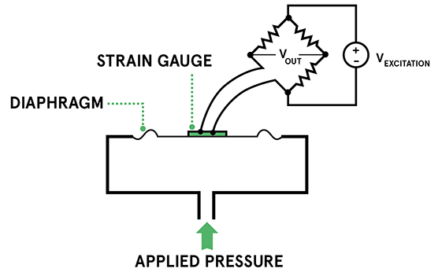
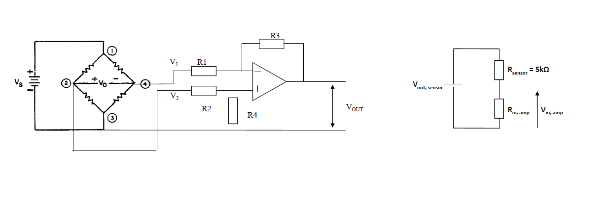

# Pressure Sensor [](./index.md)

The Honeywell 24PC Series miniature pressure sensors provide reliable gage.
Hydrostatic pressure is the pressure that is exerted by a fluid at equilibrium at a given point within the fluid, due to the force of gravity. Hydrostatic pressure increases in proportion to depth measured from the surface because of the increasing weight of fluid exerting downward force from above.

<p align="center">
    
</p>

## Piezoresistive pressure sensors

Piezoresistive pressure sensors are among the most common types of pressure sensors. They use the change in electrical resistance of a material when stretched to measure the pressure.

Piezoresistive sensors uses a strain gauge made of metal or a semiconducting material that changes its electrical resistance when it is stretched. The strain gauge can be attached to a diaphragm that recognises a change in resistance when the sensor element is deformed. The change in resistance is converted to an output signal.

<p align="center">
    
</p>

## Gauge and Absolute Pressure

When measuring pressure, determining to use gauge or absolute pressure is important.

#### Gauge Pressure

Gauge pressure is measured in relation to ambient atmospheric pressure If the gauge pressure is higher than ambient pressure it is referred to as positive pressure and if the measured gauge pressure is below atmospheric pressure it is called negative or vacuum gauge pressure.

#### Absolute Pressure

Absolute pressure is the sum of gauge pressure and atmospheric pressure. The absolute pressure in fluids cannot be negative, so the smallest absolute pressure is zero.

Generally if you want to measure a pressure that is influenced by changes in atmospheric pressure, like the level of liquid in an open tank for example; you would choose gauge pressure.
If you want to measure pressures that are not influenced by changes in atmospheric pressure, e.g. leak testing a completely sealed, you would use an absolute pressure sensor.

## Units of Pressure

SI unit for pressure is the Pascal, Pa.
Pa = N/m2 (Newton per square meter)
1 bar = 100,000 Pa = 105 Pa
1 atm = 101,325 Pa
1 psi = 6895 Pa
1 torr = 1 mmHg = 133.3 Pa
1 inch of water = 249 Pa (P=ρgh = 1000 x 9.81 x 0.0254)
P = pgh, P = Pressure, p =density of the liquid, g = acceleration due to gravity, h = height of liquid

## 24PC Sensor Data Sheet

Using the sensor sheet it will provide as a guide to choose the which 24PC series is best depend on the pressure proportional to height of the tank.

Link to Datasheet: [24PC Datasheet](./24PC.md)

## Build Circuit with 24PC Sensor

<p align="center">
    
</p>

As you can see the circuit is very similar to the temperature sensor circuit. The piezoresistors are deposited on a flexible membrane in a Wheatstone bridge arrangement. The resistance values will be large so these sensors have a high output impedance, therefore the amplifier must have very high input impedance.

## Loading of the sensor

```
Example 5% loading:

Vin,amp = 0.95 Vout,sensor. i.e 95% is amplified

    Vin,amp =  Vout,sensor \frac{Rin,amp}{Rin,amp + Rsensor)}


(Rin,amp / (Rin,amp + R )


```
