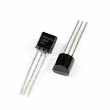
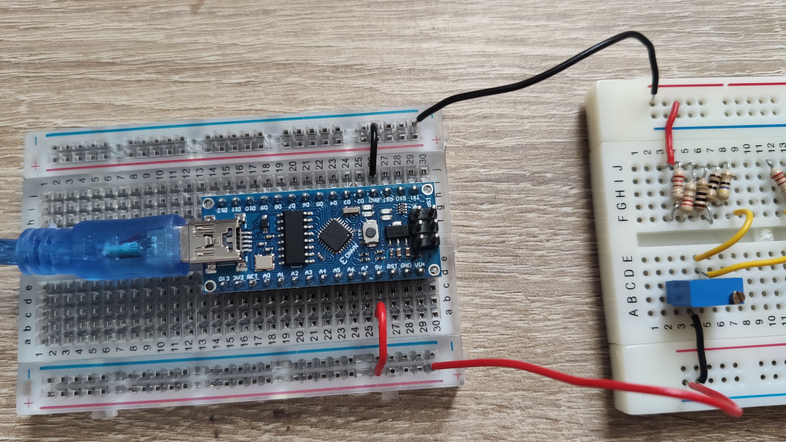

# Temperature Sensor [](./index.md)

## Types of Temperature Sensors

Before deciding to base the the temperature measurement system around the PT100, the various available options were considered. A thermocouple, US Sensors thermistor and PT100 were all considered. The table below compares the different properties of each of the three sensors

| **LM34**                               | **Thermocouple**                       | **Thermistor**                      | **PT100**                              |
| -------------------------------------- | -------------------------------------- | ----------------------------------- | -------------------------------------- |
| Large Range: -45°C to +148°C           | Large Range: -270°C to +1400°C         | Small Range: -30°C to +130°C        | Medium Range: -200°C to +850°C         |
| Output Unit: Milivolts (mV) \[linear\] | Output Unit: Milivolts (mV) \[linear\] | Output Unit: Ohms(Ω) \[non-linear\] | Output Unit: Ohms(Ω) \[linear\]        |
| Poor Stability                         | Poor Stability                         | Poor Stability                      | Decent Stability                       |
| Very low sensitivity, low accuracy     | Very low sensitivity, low accuracy     | High sensitivity, decent accuracy   | Very high sensitivity , good accuracy  |
|             |     |    |            |

### Reasons why PT100 is used

- It is one of the most accurate sensors because of its platinum material
- It covers a good range of temperature
- Good long-term stability and response time
- The relationship between resistance and temperature is relatively linear
- Relatively immune to electrical noise
- Often used in industrial operations for atmospheric conditions

### Block Diagram for PT100 circuit

<p align="center">
    
</p>

## Schematic of PT100 circuit

<p align="center">
    
</p>

### Equipment for the circuit

- Breadboards
- Arduino Nano
- 2 wire PT100
- 10K Ohm Potentiometer
- LM324 Chip
- x4 200 Ohm Resistor
- x4 10 Ohm Resistor
- x2 100 Ohm Resistor
- x2 47 Ohm Resistor
- x4 1M Ohm Resistor
- x2 470K Ohm Resistor
- Jumper Wires

### Circuit for PT100 Temperature Sensor

<p align="center">
    
</p>

### Breadboard Close Up

<p align="center">
    
</p>

### Breadboard connected to Arduino

<p align="center">
    
</p>

### Required Temperature Range

| **Tmin** | **Tmax** |
| :------: | :------: |
|  -30 °C  |  50 °C   |
| 243.15 K | 323.15 K |

With a temperature range of just -30°C to +50°C

### Table of Unit Conversion Through System

| T (°C) | T (K)  | Rth (Ω) | Vout (V) | Rescale | A/D (DU) |
| :----: | :----: | :-----: | :------: | :-----: | :------: |
|        |        |         |          |         |          |
| -30.00 | 243.15 |  88.22  |   0.00   |  0.00   |   0.06   |
| -22.00 | 251.15 |  91.37  |   0.02   |  0.53   |  107.86  |
| -14.00 | 259.15 |  94.52  |   0.04   |  1.05   |  214.28  |
| -6.00  | 267.15 |  97.65  |   0.06   |  1.56   |  319.32  |
|  2.00  | 275.15 | 100.78  |   0.08   |  2.07   |  423.03  |
| 10.00  | 283.15 | 103.90  |   0.10   |  2.57   |  525.44  |
| 18.00  | 291.15 | 107.02  |   0.12   |  3.06   |  626.58  |
| 26.00  | 299.15 | 110.12  |   0.14   |  3.55   |  726.46  |
| 34.00  | 307.15 | 113.22  |   0.16   |  4.03   |  825.13  |
| 42.00  | 315.15 | 116.32  |   0.18   |  4.51   |  922.60  |
| 50.00  | 323.15 | 119.40  |   0.20   |  4.98   | 1018.91  |

### Wheatstone Bridge Configuration

|  Vs  |  R1   |  R2   |  R3   |
| :--: | :---: | :---: | :---: |
| 4.71 | 505.8 | 505.8 | 88.22 |

### Amplifier Properties

|    Gain     | R1  | R2  | Rg  |
| :---------: | :-: | :-: | :-: |
| 24.89554462 | 2k  | 10k | 1k  |

### Arduino Code

```
int vinPin = A0;
int vin;
float outDegC;

void setup()
{
    Serial.begin(9600);

void loop()
{
    delay(500);
    //delay for half a second

    vin = analogRead(vinPin);
    //read in value from Arduino

    outDegC = (vin * .0785) - 30;
    //rescale back to degrees celsius
    // (50 - (-30)) / 1019 bits = 0.785

    Serial.print("Voltage In Bits: ");
    Serial.print(vin);
    Serial.print("\t\t\t");
    // print out in voltage in bits on screen

    Serial.print("Temperature: ");
    Serial.print(outDegC);
    Serial.print(" °C\t\t\t");
    // print out in degrees on screen

    Serial.println();
}

```
