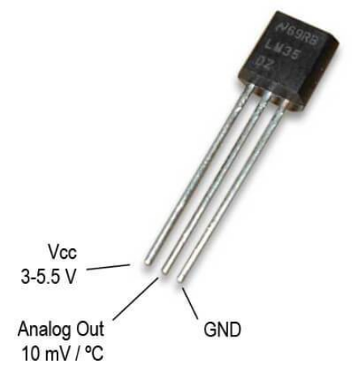
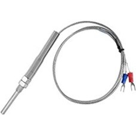
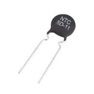
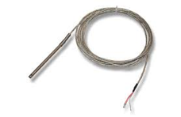
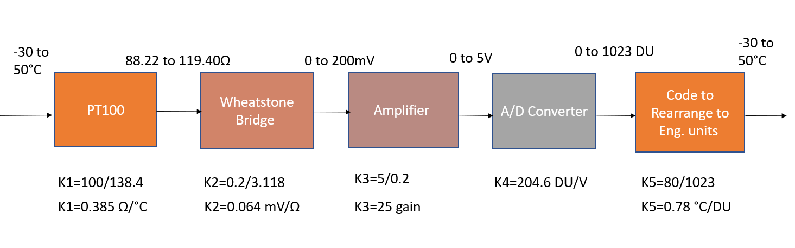
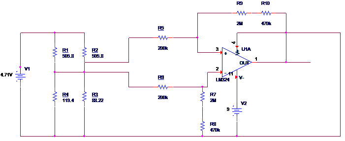
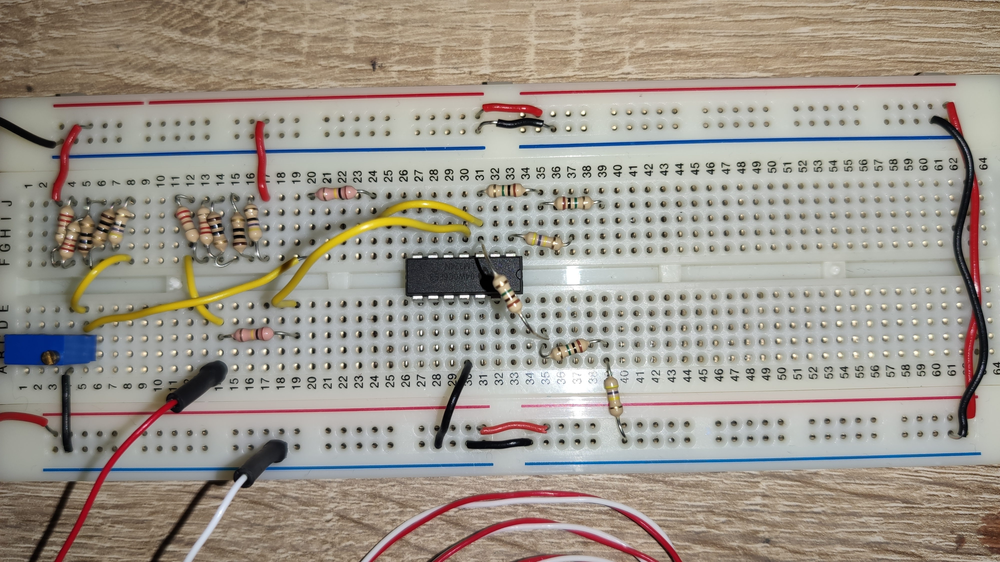

# Temperature Sensor

# Table of contents

1. [Types of Temperature Sensors](#Types-of-Temperature-Sensors)
   1. [Reasons why PT100 is used](#Reasons-why-PT100-is-used)
   2. [Block Diagram for PT100 ciruit](#Block-Diagram-for-PT100-ciruit)
   3. [Schematic of PT100 ciruit](#Schematic-Of-PT100-ciruit)
   4. [Equipment for the circuit](#Equipment-for-the-circuit)
   5. [Required Temperature Range](#Required-Temperature-Range)
      1. [Circuit for PT100 Temperature Sensor](#Circuit-for-PT100-Temperature-Sensor)
      2. [Breadboard Close Up](#Breadboard-Close-Up)
      3. [Breadboard connected to Arduino](#Breadboard-connected-to-Arduino)
   6. [Temperature Range](#temperature-range)
   7. [Table of Unit Conversion Through System ](#Table-of-Unit-Conversion-Through-System)
   8. [Wheatstone Bridge Configuration](#Wheatstone-Bridge-Configuration)
      1. [Calculation for Wheatstone Bridge](#Calculation-for-Wheatstone-Bridge)
   9. [Amplifier Properties](#Amplifier-Properties)
      1. [Pin diagram of LM324](#Pin-diagram-of-LM324)
   10. [Arduino Code](#Arduino-Code)
   11. [Procedure](#Procedure)

### Types of Temperature Sensors

Before deciding to base the the temperature measurement system around the PT100, the various available options were considered. A LM35, thermocouple, US Sensors thermistor and PT100 were all considered. The table below compares the different properties of each of the sensors:

|               **LM35**                |           **Thermocouple**            |          **Thermistor **          |               **PT100**               |
| :-----------------------------------: | :-----------------------------------: | :-------------------------------: | :-----------------------------------: |
|                                       |                                       |
|     Small Range: -55°C to +150°C      |    Large Range: -270°C to +1400°C     |   Small Range: -30°C to +130°C    |    Medium Range: -200°C to +850°C     |
| Output Unit: Millivolts (mV) [linear] | Output Unit: Millivolts (mV) [linear] | Output Unit: Ohms(Ω) [non-linear] |     Output Unit: Ohms(Ω) [linear]     |
|            Poor Stability             |            Poor Stability             |          Poor Stability           |           Decent Stability            |
|  Very low sensitivity, low accuracy   |  Very low sensitivity, low accuracy   | High sensitivity, decent accuracy | Very high sensitivity , good accuracy |
|            |    |  |           |

### Reasons why PT100 is used

- It is one of the most accurate sensors because of its platinum material
- It covers a good range of temperature
- Good long-term stability and response time
- The relationship between resistance and temperature is relatively linear
- Relatively immune to electrical noise
- Often used in industrial operations for atmospheric conditions

### Block Diagram for PT100 circuit

<p align="center">
    
</p>

## Schematic of PT100 circuit

<p align="center">
    
</p>

### Equipment for the circuit

- Breadboards
- Arduino Nano
- 2 wire PT100
- 10K Ohm Potentiometer
- LM324 Chip
- x4 200 Ohm Resistor
- x4 10 Ohm Resistor
- x2 100 Ohm Resistor
- x2 47 Ohm Resistor
- x4 1M Ohm Resistor
- x2 470K Ohm Resistor
- Jumper Wires

### Circuit for PT100 Temperature Sensor

<p align="center">
    
</p>

### Breadboard Close Up

<p align="center">
    
</p>

### Breadboard connected to Arduino

<p align="center">
    
</p>

### Required Temperature Range

| **Tmin** | **Tmax** |
| :------: | :------: |
|  -30 °C  |  50 °C   |
| 243.15 K | 323.15 K |

With a temperature range of just -30°C to +50°C

### Table of Unit Conversion Through System

| T (°C) | T (K)  | Rth (Ω) | Vout (V) | Rescale | A/D (DU) |
| :----: | :----: | :-----: | :------: | :-----: | :------: |
| -30.00 | 243.15 |  88.22  |   0.00   |  0.00   |   0.06   |
| -22.00 | 251.15 |  91.37  |   0.02   |  0.53   |  107.86  |
| -14.00 | 259.15 |  94.52  |   0.04   |  1.05   |  214.28  |
| -6.00  | 267.15 |  97.65  |   0.06   |  1.56   |  319.32  |
|  2.00  | 275.15 | 100.78  |   0.08   |  2.07   |  423.03  |
| 10.00  | 283.15 | 103.90  |   0.10   |  2.57   |  525.44  |
| 18.00  | 291.15 | 107.02  |   0.12   |  3.06   |  626.58  |
| 26.00  | 299.15 | 110.12  |   0.14   |  3.55   |  726.46  |
| 34.00  | 307.15 | 113.22  |   0.16   |  4.03   |  825.13  |
| 42.00  | 315.15 | 116.32  |   0.18   |  4.51   |  922.60  |
| 50.00  | 323.15 | 119.40  |   0.20   |  4.98   | 1018.91  |

### Wheatstone Bridge Configuration

|  Vs  |  R1   |  R2   |  R3   |
| :--: | :---: | :---: | :---: |
| 4.71 | 505.8 | 505.8 | 88.22 |

#### Calculation for Wheatstone Bridge

```
Bridge equation:
Vout = Vs(Rth/Rth+R2 - R3/R3+R1)

Where R1 = R2 = R
Where Rth = PT100 at highest temp -30 °C = 119.40 ohm
Where R3 = PT100 at highest temp 50 °C = 88.22 ohm

0.2 = 4.71(119.40/119.40+R - 88.22/88.22+R)

Rearrange the equation to solve for R.

Divide both sides by 4.71:

0.042 = 119.40/119.40+R - 88.22/88.22+R

Cross multiply:

0.042 = 119.40(88.22+R) - 88.22(119.40+R) / (119.40+R)(88.22+R)

0.042 = (119.40*R - 88.22*R) / 119.40*88.22+R * 88.22+119.4 *R +R^2)

0.042 = 31.18*R / 119.40*88.22+R * 88.22+119.4 *R +R^2)

0.042 = 31.18R/10,533.47 +207.62R + R^2

0.042(10,533.47 +207.62R + R^2) = 31.18R
442.41+8.72R+0.042R^2 = 31.18R
0.042R^2 -22.46R +442.41 = 0

Use -b formula to solve for R:

R = 514.28
```

The potentiometer must be configured to 88.22.

### Amplifier Properties

|    Gain     | R1  | R2  | Rg  |
| :---------: | :-: | :-: | :-: |
| 24.89554462 | 2k  | 10k | 1k  |

#### Pin diagram of LM324

<p align="center">
    
</p>

Pin 4 is connected to the 5V of the arduino.
Pin 11 is connected to ground.

### Arduino Code

```
int vinPin = A0;
int vin;
float outDegC;

void setup()
{
    Serial.begin(9600);

void loop()
{
    delay(500);
    //delay for half a second

    vin = analogRead(vinPin);
    //read in value from Arduino

    outDegC = (vin * .0785) - 30;
    //rescale back to degrees celsius
    // (50 - (-30)) / 1019 bits = 0.785

    Serial.print("Voltage In Bits: ");
    Serial.print(vin);
    Serial.print("\t\t\t");
    // print out in voltage in bits on screen

    Serial.print("Temperature: ");
    Serial.print(outDegC);
    Serial.print(" °C\t\t\t");
    // print out in degrees on screen

    Serial.println();
}

```

## Procedure

1. Prepare the equipments listed above.
2. The circuit can be divided into into 2 parts:

   1. Wheatstone bridge

   - Place your Arduino Nano onto the breadboard and connect the Vcc and Ground to the according rails on the breadboard.
   - Place the potentiometer and configure it to 88.22Ω.
   - Put the resistors into place, as seen from the breadboard images from above.
   - Use the multimeter to check that the output is correct, replace the PT100 with a 119Ω resistor to check the output that should be 0.2V.

   2. Differential Amplifier

   - Connect pin 4 to Vcc and pin 11 to ground. Check the pin diagram. Connect the resistors as seen in the image above. Then connect it to the wheatstone bridge indicted by the yellow jumper cables.
