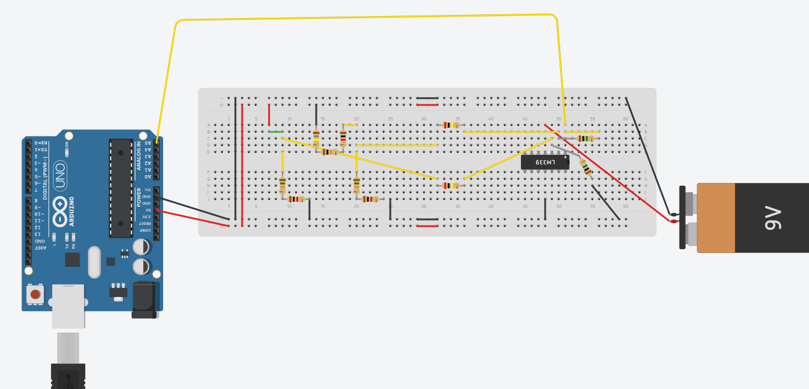
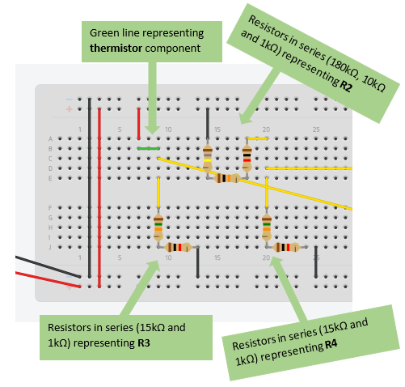
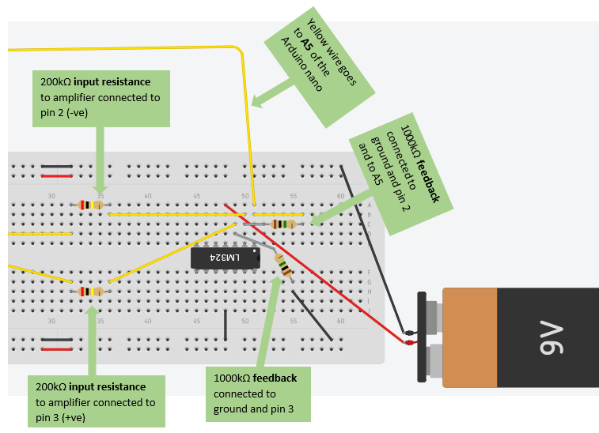

# Thermistor [](./index.md)

# Table of contents
1. [Introduction](#Thermistor)
    1. [Reasons to use Thermistor](#reasons-to-use-thermistor)
    2. [Block Diagram](#block-diagram)
    3. [Schematic of Thermistor](#schematic-of-thermistor)
    4. [Circuit Layout on Breadboard](#circuit-layout-on-breadboard)
    5. [Configurations for Excel](#configurations-for-excel)
        1. [Temperature Range](#temperature-range)
        2. [Voltage Divider Properties ](#voltage-divider-properties)
        3. [Wheatstone Bridge Properties](#wheatstone-bridge-properties)
    1. [Final Excel Sheet](#final-excel-sheet)
        1. [Calculating the gain](#calculating-the-gain)
    1. [Equipments required](#equipments-required)
    2. [Procedure](#procedure)

# Thermistor
The type of the thermistor that we are going to be using the NTC thermistor USP10972. Thermistor is a temperature measurement system which is thermally sensitive resistor. Click here to see the datasheet.

## Reasons to use Thermistor
- Cheaper than PT100
- Small Temperature range but enough for agribot
- High sensitivity, decent accuracy

## Block Diagram
<p align="center">
    
</p>

## Schematic of Thermistor
<p align="center">
    
</p>

## Circuit Layout on Breadboard
This section is showing how the thermistor could be laid out on a breadboard with all the values that were calculated and show in the "Wheatstone Bridge Properties" section of this page.
<p align="center">
    
</p>

## Configurations for Excel
Different Properties that was used in excel will be shown here. The excel sheet will also be available to download just click here.

### Temperature Range
| **Tmin** | **Tmax** |
| :------: | :------: |
|  -30 °C  |  50 °C   |
| 243.15 K | 323.15 K |

### Voltage Divider Properties 
|  Vs  |  Bottom R  |  
| :--: | :--------: | 
|   5  |    5099    | 

### Wheatstone Bridge Properties 
To get these properties simultaneous equations is needed. To make it easier, we used the website called "wolframalpha" and inserted the 3 equations there. For this temperature range the resistors that we got are shown below:

|    Vs   |    R2     |    R3   |    R4   |
| :-----: | :-------: | :-----: | :-----: |
| 1.35496 |   191585  | 16114.3 | 16114.3 |

**Steps to get the 3 equations for simultaneous equations**
1. Get the temperature range required, and calculate the Rth of these temperature Range. In this example the temperature range is -30 to 50
2. Note the Rth of the minimum, middle and maximum degrees. For example, refering to the excel sheet below -30 degC(min) is 191585ohms, 10 degC(middle) is 19968ohms and 50 degC (max) is 3643ohms. 
3. Substitute this value in the equations below:
```
                                             0 = x(1/(1+(MinimumRth/y))-1/(1+z))
                                            0.5 = x(1/(1+(MiddleRth/y))-1/(1+z))
                                             1 = x(1/(1+(MaximumRth/y))-1/(1+z))
```
4. Use wolframalpha website here and put in the 3 equations. It will then give you x,y,z values where x is Vs, y is R3 and z is R2/R4.
5. Note that R4=R3 so to calculate R2 on its own multiply z value by R4.
6. These will then give you all the resistor values for the wheatstone bridge.

The diagram below will help visualise the location of the resistors in the circuit and briefly explain where each of the values were taken.
<p align="center">
    
</p>

## Final Excel Sheet 
| T (°C) | T (K)  | Rth (Ω) | Vout (V) | A/D (DU) | Rescaled  |
| :----: | :----: | :-----: | :------: | :------: | :------:  |
|        |        |         |          |          |           |
| -30.00 | 243.15 | 191585  |   0.00   |   0.00   |  -26.92   |
| -22.00 | 251.15 | 115062  |   0.06   |  12.55   |  902.51   |
| -14.00 | 259.15 | 71313   |   0.14   |  29.59   |  2164.83  |
| -6.00  | 267.15 | 45483   |   0.25   |  51.02   |  3751.98  |
|  2.00  | 275.15 | 29778   |   0.37   |  75.83   |  5590.46  |
| 10.00  | 283.15 | 19968   |   0.50   |  102.30  |  7550.91  |
| 18.00  | 291.15 | 13687   |   0.63   |  128.39  |  9483.81  |
| 26.00  | 299.15 | 9573    |   0.74   |  152.40  |  11262.09 |
| 34.00  | 307.15 | 6822    |   0.85   |  173.26  |  12807.49 |
| 42.00  | 315.15 | 4945    |   0.93   |  190.62  |  14092.92 |
| 50.00  | 323.15 | 3643    |   1.00   |  204.60  |  15128.95 |

### Calculating the gain
Gain of 5 is needed so:
- Input resistance (values for R5 and R6)  = 200k ohms
- Feedback (values for R7 and R8) = 1000k ohms

The diagram below is showing the location of the input resistance and the feedback. The 9V is the circuit is the battery that we used when we built the circuit on the breadboard. This can be seen on the diagram encircled in red. The 200k input resistance and the 1000k feedback would give us the 5 gain that we needed. 
<p align="center">
    
</p>

## Equipments required
- Thermistor
- Arduino Nano
- Resistors
- LM324
- 9V battery
- Breadboard
- Wires

## Procedure
1. Collect all the equipments listed above.
2. For clarity of the circuit, make sure that you use different colours for the wirings. i.e. red for Vcc, black for ground and yellow or other colour (except the 2  colours that already mentioned) for the other connections in the circuit. Be consistent of colour coding with the wires, this will make it easier to understand the circuit connections. Divide the circuit into 2 parts: 
    1. **Wheatstone bridge** 
    - Place your Arduino Nano onto the breadboard and place the resistors in series to make up the wheatstone bridge, the values for the wheatstone bridge is shown in the "Wheatstone bridge properties" section of this page and it also shows how these values were calculated. See the diagram below to see how it has been laid out on the breadboard. Note that the green line represents the thermistor component and also that the wires are colour coded as already stated in step 2. The two long yellow wires will be the input to the amplifier.
<p align="center">
    
</p>
    2. **Differential Amplifier** 
    - Next to build is the differential amplifier part. The pinouts of the amplifier click here to see. Connect pin 4 to 9V battery (red wiring) and pin 11 to ground (black wiring), for other connections of the amplifier see the diagram below.
<p align="center">
    
</p>
    - When the 2 parts of the circuit is done refer to the section called "Circuit Layout on Breadboard" to make sure that you connected both of the parts together correctly.