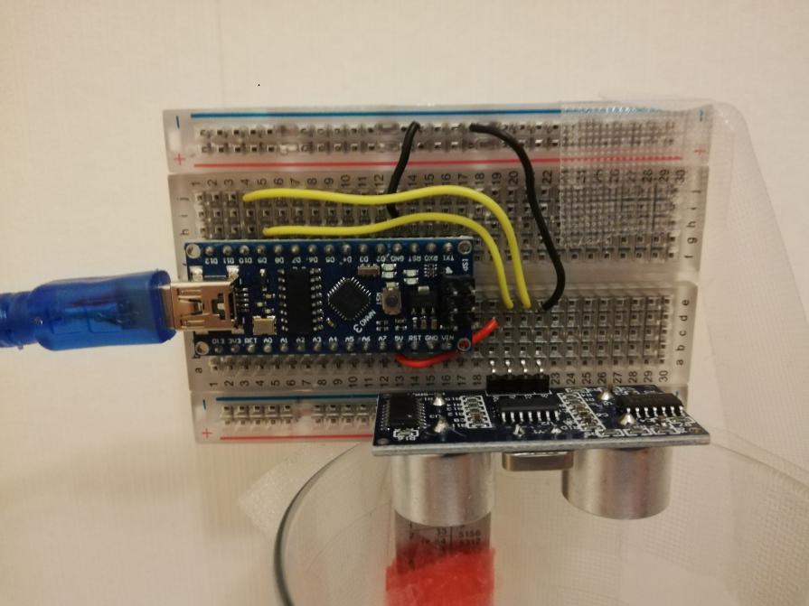

# Table of contents
1. [Introduction](#Ultrasonic-Sensor)
    1. [Schematic of Ultrasonic Sensor](#Schematic-of-Ultrasonic-Sensor)
    2. [Calculation Explanations](#Calculation-Explanations)
        1. [Calculating the distance](#Calculating-the-distance)
        2. [Calculating the percentage of water](#Calculating-the-percentage-of-water)
    3. [Code Explanation](#Code-Explanation)
        1. [Defining the pins and the variables](#Defining-the-pins-and-the-variables)
        2. [Setup section](#Setup-section)
        3. [Loop section](#Loop-section)
        4. [pulseIN function and calculating distance and percentage of water](#pulseIN-function-and-calculating-distance-and-percentage-of-water)
        5. [Complete Code](#Complete-Code)
    4. [Equipments for the demonstration](#Equipments-for-the-demonstration)
        1. [Initial installation of the circuit and code](#Initial-installation-of-the-circuit-and-code)
        2. [Testing](#Testing)
    5. [Ultrasonic Demonstration](#Ultrasonic-Demonstration)
    6. [Ideas for additional features](#Ideas-for-additional-features)
    7. [Helpful Youtube Video](#Helpful-Youtube-Video)
___
# Ultrasonic Sensor

The HC-SR04 Ultrasonic sensor component will be used to measure the level of the water in a tank. The data will be pass 
onto the arduino nano. The code will be written on the software called Arduino IDE.

___
<p align="center">
    
</p>

**Pin Number**|**Pin Name**|**Description**
:-----:|:-----:|:-----:
1|Vcc|The Vcc pin powers the sensor, typically with +5V
2|Trigger|Trigger pin is an Input pin. This pin has to be kept high for 10us to initialize measurement by sending US wave.
3|Echo|Echo pin is an Output pin. This pin goes high for a period of time which will be equal to the time taken for the US wave to return back to the sensor.
4|Ground|This pin is connected to the Ground of the system.

## Schematic of Ultrasonic Sensor
<p align="center">
    
</p>

The table below shows the pin name and their corresponding arduino pins. The trigger and echo pin could be
changed into a different digital pins but ensure that the code in the Arduino IDE is modified with it.

**Pin Name**|**Arduino Pins**
:-----:|:-----:
Vcc|5V
Trigger|Digital Pin 9 (D9)
Echo|Digital Pin 10 (D10)
Gnd|Ground

## Calculation Explanations
This section will explain the equations and calculations that were used in the code.
### Calculating the distance
In this example, if the height of the glass is 13.2cm and the speed of the sound is 340m/s or 0.034 cm/us the sound wave will need to travel 294us. But the value that you will get from the Echo pin will be double that number as the sound wave needs to travel forward and bounce backward. So to get the distance in cm we need to multiply the received travel time value from echo pin by 0.034 and divide the answer by 2. The code that does this calculation is:
```
                                        distance= duration*0.034/2;
```
For a clearer explanation of the calculation refer to the diagram and the formula provided.
<p align="center">
    
</p>

### Calculating the percentage of water
To calculate the water percentage in the glass, the distance that you get from the calculation above is divided by the tank height, in this case 13.2, multiply the answer by 100. From this you will get the percentage of the empty space in the glass but since we want to know the percentage of water in the the glass you minus the answer from 100. The code that does this calculation is:
```
                                waterpercent = 100-(distance/tankHeight)*100;
```

## Code Explanation
Each block of the code will be explained here and the complete code will be provided at the end aswell as on the top right corner
of the this and main page available for download.

### Defining the pins and the variables
This block of code defines the pins of the trigger and the echo pin. In this case they are the digital pins number 9 and 10 on the Arduino board. They are named as "trigPin" and "echoPin" for clarity of the code. 
The variables are then defined. The travel time you'll get from the sensor is declared as a long variable and named as "duration". A float type is needed for the "distance" variable. "waterpercent" is set to integer type as this will be used for the calculation of the percentage of water in a tank. "tankHeight" is an constant float that is equal to value 13.2 as an example height of a tank, this could be later modified to a different tank height.

```
// defines pins numbers for trigger and echo
const int trigPin = 9;      //Sets Trigger to Digital Pin 9
const int echoPin = 10;     //Sets Echo to Digital Pin 10

// defines variables
long duration;
float distance;
int waterpercent;
const float tankHeight = 13.2; //INSERT TANK HEIGHT HERE//
```
### Setup section
In setup define the trigPin as an output and the echoPin as an input. The serial communication is required to be started to show the data on the serial monitor.

```
void setup() {
pinMode(trigPin, OUTPUT);    // Sets the trigPin as an Output
pinMode(echoPin, INPUT);    // Sets the echoPin as an Input
Serial.begin(9600);        // Starts the serial communication
}

```
### Loop section
At the start of the loop, you need to ensure that the trigPin is clear, to do this set the pin on a LOW state for 2 µs. To generate the Ultra sound wave, set the trigPin on a HIGH state for 10 µs.

```
void loop() {
delay(1000);
// Clears the trigPin
digitalWrite(trigPin, LOW);
delayMicroseconds(2);

// Sets the trigPin on HIGH state for 10 micro seconds
digitalWrite(trigPin, HIGH);
delayMicroseconds(10);
digitalWrite(trigPin, LOW)

```
### pulseIN function and calculating distance and percentage of water
pulseIn () function has 2 variables, the first entry in the bracket is the name of the echo pin (echoPin) and the second entry you can set it to on a HIGH or LOW. This function will read the travel time and put in the variable called duration.
In the code, HIGH means that the pulseIn() function will wait for the pin to go HIGH. This is caused by the bounced of the sound wave. It will then start the timing and wait until the pin is LOW when the sound wave will end and stop the timing. It will then return the length of the pulse in microsecond.

For the distance, the data in the duration variable will be multiplied by 0.032 and divide it by 2. The 0.032 value comes from the fact that the speed of the sound is 340 m/s or 0.034 cm/µs. It is divided by 2 since the data that you will get in the echoPin would be doubled as the sound wave needs to travel forward and bounce backward. So in order to get the distance in cm we need to multiply the received data in echoPin which is stored in "duration" variable by 0.034 and then divide it by 2. The distance value is then divided by the "tankHeight" which was set to 13.2, multiply it to 100 and minus the calculated value to 100. This will be percentage of the water inside the tank.
The value of the distance in cm and the percentage of the water in the tank will be displayed on the serial monitor of the Arduino IDE. The "distance" value that is shown on the serial monitor is showing the empty space capacity inside the tank. 


```
// Reads the echoPin, returns the sound wave travel time in microseconds
duration = pulseIn(echoPin, HIGH);
// Calculating the distance
distance= duration*0.034/2;
// Prints the distance on the Serial Monitor
Serial.print("Distance: ");
Serial.print(distance);
Serial.println("cm");
waterpercent = 100-(distance/tankHeight)*100;     //Calculates the percentage of water in the tank
Serial.print("Percentage Full: ");
Serial.print(perc);
Serial.println("%");
}

```
### Complete Code
Here is the complete code.
```
// defines pins numbers for trigger and echo
const int trigPin = 9;      //Sets Trigger to Digital Pin 9
const int echoPin = 10;     //Sets Echo to Digital Pin 10

// defines variables
long duration;
float distance;
int waterpercent;
const float tankHeight = 13.2; //INSERT TANK HEIGHT HERE//

void setup() {
pinMode(trigPin, OUTPUT);   // Sets the trigPin as an Output
pinMode(echoPin, INPUT);    // Sets the echoPin as an Input
Serial.begin(9600);         // Starts the serial communication
}

void loop() {
delay(1000);
// Clears the trigPin
digitalWrite(trigPin, LOW);
delayMicroseconds(2);
// Sets the trigPin on HIGH state for 10 micro seconds
digitalWrite(trigPin, HIGH);
delayMicroseconds(10);
digitalWrite(trigPin, LOW);
// Reads the echoPin, returns the sound wave travel time in microseconds
duration = pulseIn(echoPin, HIGH);
// Calculating the distance
distance= duration*0.034/2;
// Prints the distance on the Serial Monitor
Serial.print("Distance: ");
Serial.print(distance);
Serial.println("cm");
waterpercent = 100-(distance/tankHeight)*100;     //Calculates the percentage of water in the tank
Serial.print("Percentage Full: ");
Serial.print(waterpercent);
Serial.println("%");
}

```
## Equipments for the demonstration
To set up for the demonstration the required equipments are listed below:

+ HC-SR04 ultrasonic
+ Arduino Nano and cable 
+ Different colour wires (red(Vcc),black(ground),yellow(wires for connecting sensor to arduino))
+ Cylinder glass
+ Ruler
+ Sellotape
+ Computer (download Arduino IDE)
+ stick or extra ruler (to hold the circuit onto the glass)

## Setup for the demonstration
In this section, I will be listing in order the following steps that needs to be taken in order to build the circuit and do the demonstration

### Initial installation of the circuit and code
1. Collect all the equipments listed above.
2. Place your Arduino Nano onto the breadboard aswell as the HC-SR04 ultrasonic sensor. For circuit building and wiring follow the figure and table shown on the "schematic of ultrasonic sensor" section of this page. 
3. For clarity of the circuit, make sure that you use different colours for the wirings. i.e. red for Vcc, black for ground and yellow or other colour (except the 2 colours that already mentioned) for the wiring of the ultrasonic sensor to the Arduino Nano digital pins.
4. Downloand the Arduino IDE software from the Arduino website and copy the code above and verify and upload to the Arduino Nano.
5. Once the code has been verified and uploaded, use a stick or an extra ruler to place the circuit on to the top of the glass. Use  sellotape until the setup is stable. Use the image below for reference as to how you can set it up. Take note that the end of the ultrasonic sensor (silver part) is align with edges at the top of the glass. i.e. the ultrasonic sensor is not inside of the glass or too high up or else inaccurate readings of the sensor will occur.
6. Now that the initial installation is done follow the steps below to test the sensor.

<p align="center">
    
</p>

### Testing
1. Firstly, measure the height of the cylinder glass, use a ruler to do this. Ensure that you measure from inside of the glass to get the most accurate measurement of the height. Then modify the code according to the height. Code to be modified is shown below:
```
                 const float tankHeight = 13.2;  //INSERT TANK HEIGHT HERE//
```
2. Verify and upload the code again to the Arduino Nano. Once done, look at the serial monitor in the Arduino IDE. This is where you're gonna see the "distance" (height) and the percentage of water. At this stage the distance should be the same or close to your measured height of the glass and percentage of water should be 0%.
3. Fill up the glass with water and take note of the height of the water. In this way you can measure the percentage error. On the serial monitor the "distance" is showing the empty space capacity of the glass and the percentage of the water inside.
4. Lastly, calculate the percentage error by doing the formula below:
```
            Percentage error = (Theoretical value - Experimental value / Theoretical value ) * 100 
```
5. Reference to the demonstration video in the next section.

## Ultrasonic Demonstration
This is the demonstration for the HC-SR04 following the steps taken highlighted above.

[](https://youtu.be/rX2mORhe_jk)


## Ideas for additional features
Incorporating **liquid-crystal display (LCD)** into the project would make it easier for the user to know the distance and the percentage of the water without having to look at the serial monitor.

Another great feature would be **light emitting diodes (L.E.D)**. This component could be use as an indication of the water level in a tank. Different colour would mean different level, for example if a green LED light up, this could mean that the water level is between 0 to 30%, orange LED indicates that water level is around 30 to 60% and lastly red LED means that the water level is at a critical level (60% and above) that if more water is added the tank could overflow. 

<p align = "center">
    
</p>

## Helpful Youtube Video
Link to a youtube video showing how ultrasonic sensor works and explained how it calculated the value of the distance.

[](https://www.youtube.com/watch?v=ZejQOX69K5M&ab_channel=HowToMechatronics)

<a href = "https://www.youtube.com/watch?v=ZejQOX69K5M&ab_channel=HowToMechatronics" target = "_self" align="center"> 
      
</a>
